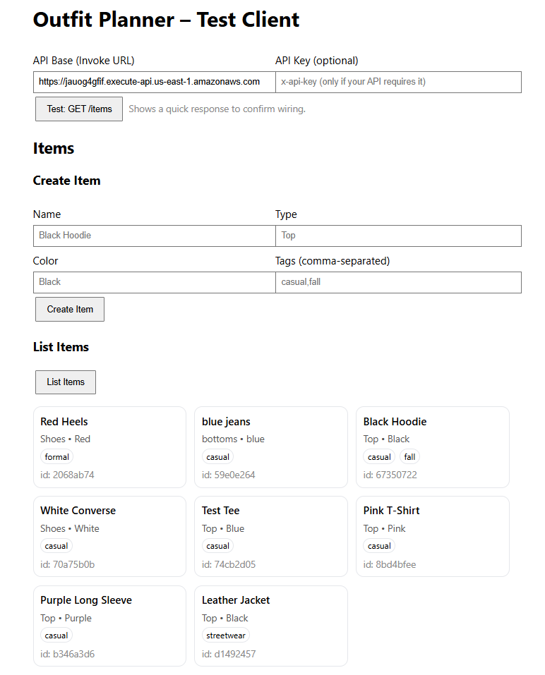
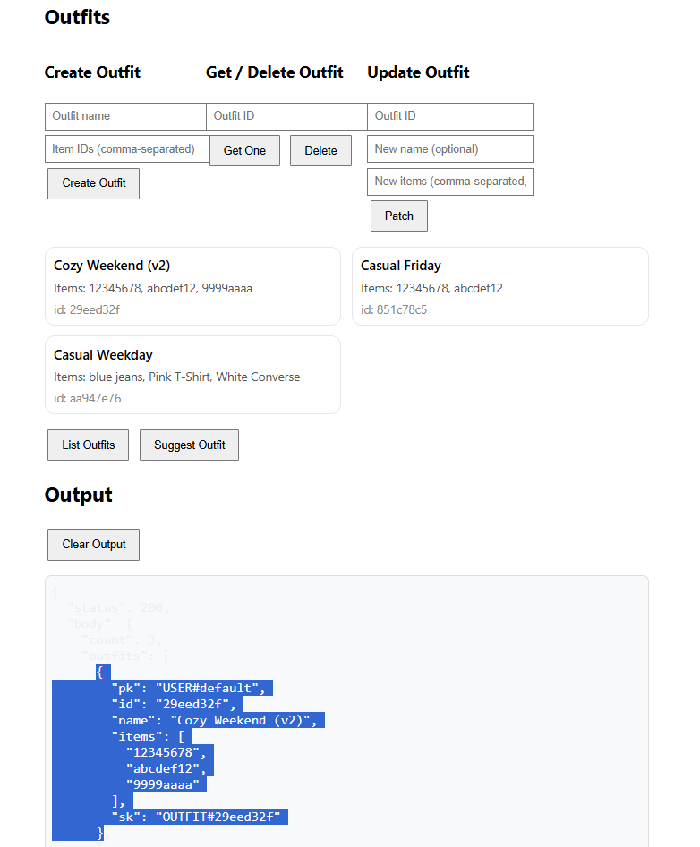

# 👗 Outfit Planner – AWS CDK Project

A **serverless outfit planning app** built with **AWS CDK (Python)**.  
It uses **API Gateway**, **Lambda**, and **DynamoDB** for backend logic, with **S3 + CloudFront** hosting the static web client.  
Users can create, list, and view outfit items in a responsive web interface.

🔗 **Live Demo:** [https://d13vpwdkbkv4ik.cloudfront.net](https://d13vpwdkbkv4ik.cloudfront.net)

---

## 🏗️ Architecture Overview

**Frontend:**  
- Static website hosted on **Amazon S3**  
- Distributed via **CloudFront (HTTPS)**  

**Backend:**  
- **API Gateway** routes REST requests  
- **Lambda functions** handle CRUD operations  
- **DynamoDB** stores outfit data  
- **CDK (Python)** defines and deploys infrastructure  

---

## 🖼️ Screenshots

| Web App | DynamoDB Table |
|---|---|
|  |  |

---

## 📁 Project Structure

op-cdk/
├── app.py # CDK app entry point
├── stacks/ # CDK stack definitions (Dev/Prod)
├── lambda/ # Lambda function code
├── postman/ # API test collection
├── README.md # Project documentation
└── requirements.txt # Python dependencies

yaml
Copy code

---

## 🧰 Setup Instructions

This project is set up like a standard Python CDK project.  
It uses a virtual environment (`.venv`) to manage dependencies.

### Create and activate virtual environment

**MacOS / Linux**
python3 -m venv .venv
source .venv/bin/activate

markdown
Copy code

**Windows**
python -m venv .venv
.venv\Scripts\activate.bat

shell
Copy code

### Install dependencies
pip install -r requirements.txt

shell
Copy code

### Synthesize CloudFormation template
cdk synth

shell
Copy code

### Deploy the stack
cdk deploy

yaml
Copy code

---

## 🧩 Useful CDK Commands

| Command | Description |
|----------|-------------|
| `cdk ls` | List all stacks in the app |
| `cdk synth` | Emit synthesized CloudFormation template |
| `cdk deploy` | Deploy the stack to your AWS account/region |
| `cdk diff` | Compare deployed stack with current state |
| `cdk docs` | Open AWS CDK documentation |

---

## ☁️ Stacks

### OutfitPlanner-Dev
- Table: `OutfitPlanner-dev` (DESTROY on delete)
- CORS: `*`

### OutfitPlanner-Prod
- Table: `OutfitPlanner-prod` (RETAIN on delete)
- CORS: `https://d13vpwdkbkv4ik.cloudfront.net`

---

## 🔍 Useful CLI Commands

Get Prod API URL:
aws cloudformation describe-stacks --stack-name OutfitPlanner-Prod
--query "Stacks[0].Outputs[?OutputKey=='ApiUrl'].OutputValue"
--output text

yaml
Copy code

---

## 🩺 Health Check

`GET /health` → returns:
{ "ok": true, "service": "OutfitPlanner", "stage": "prod", "table": "OutfitPlanner-prod", "time": "..." }

yaml
Copy code

Prod CORS: `https://d13vpwdkbkv4ik.cloudfront.net`

---

## 🧾 Version Endpoint

`GET /version` → returns:
{ "version": "v0.6-week5", "stage": "prod", "deployedAt": "..." }

yaml
Copy code

---

## 📬 Postman Collection

Import the file:
postman/OutfitPlanner.postman_collection.json

javascript
Copy code

Set collection variable:
base = <ApiUrl from CloudFormation outputs>

yaml
Copy code

---

## ✅ Current Version

**APP_VERSION:** `v0.6-week5`  
**Stacks deployed:** Dev + Prod  
**CloudFront URL:** [https://d13vpwdkbkv4ik.cloudfront.net](https://d13vpwdkbkv4ik.cloudfront.net)

---
